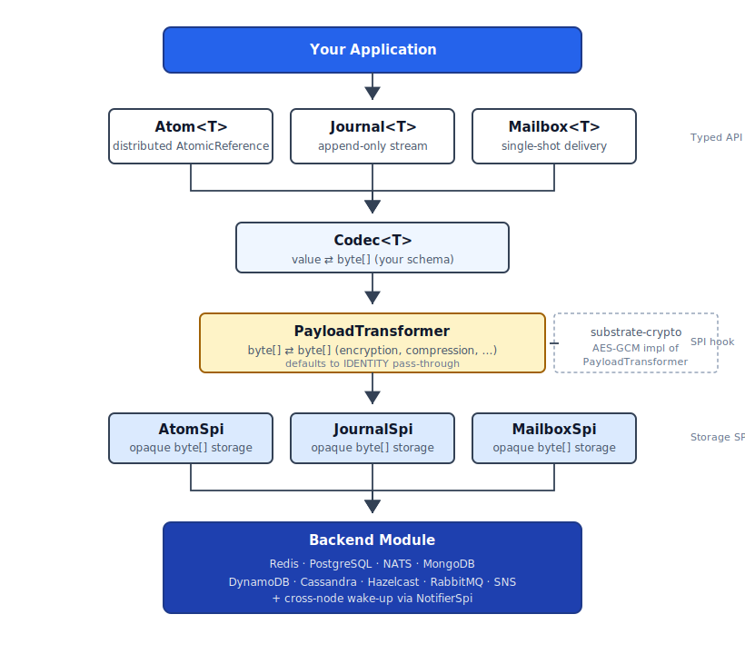

# Substrate

[](https://github.com/jwcarman/substrate/actions/workflows/maven.yml)
[](https://github.com/jwcarman/substrate/actions/workflows/github-code-scanning/codeql)
[](https://opensource.org/licenses/Apache-2.0)
[='java.version']/text()&label=Java&color=orange)](https://openjdk.org/)
[](https://central.sonatype.com/artifact/org.jwcarman.substrate/substrate-core)

[](https://sonarcloud.io/summary/new_code?id=jwcarman_substrate)
[](https://sonarcloud.io/summary/new_code?id=jwcarman_substrate)
[](https://sonarcloud.io/summary/new_code?id=jwcarman_substrate)
[](https://sonarcloud.io/summary/new_code?id=jwcarman_substrate)
[](https://sonarcloud.io/summary/new_code?id=jwcarman_substrate)
[](https://sonarcloud.io/summary/new_code?id=jwcarman_substrate)

Distributed data structures for Spring Boot. Substrate provides three
primitives -- Atom, Journal, and Mailbox -- that abstract away the underlying
infrastructure, letting applications work with distributed leased values,
streams, and futures without coupling to any specific technology.

## Requirements

- Java 25+
- Spring Boot 4.x
- [Codec](https://github.com/jwcarman/codec) 0.1.0+ (for typed API)

## Quick Start

Add the BOM and the backend modules you need. Backend modules are organized
**per backend** -- one module per technology, supplying whichever SPI
implementations that backend supports.

```xml
<dependencyManagement>
    <dependencies>
        <dependency>
            <groupId>org.jwcarman.substrate</groupId>
            <artifactId>substrate-bom</artifactId>
            <version>0.5.0</version>
            <type>pom</type>
            <scope>import</scope>
        </dependency>
    </dependencies>
</dependencyManagement>

<dependencies>
    <!-- Core (required) -->
    <dependency>
        <groupId>org.jwcarman.substrate</groupId>
        <artifactId>substrate-core</artifactId>
    </dependency>

    <!-- Pick a codec backend for typed API -->
    <dependency>
        <groupId>org.jwcarman.codec</groupId>
        <artifactId>codec-jackson</artifactId>
        <version>0.1.0</version>
    </dependency>

    <!-- Pick a backend module (one per backend, not one per SPI) -->
    <dependency>
        <groupId>org.jwcarman.substrate</groupId>
        <artifactId>substrate-redis</artifactId>
    </dependency>
</dependencies>
```

You can mix backends — e.g., add `substrate-redis` for Atom and Mailbox and
`substrate-postgresql` for Journal in the same application.

**Each backend module is a Spring Boot auto-configuration.** Drop it on the
classpath and the SPIs it provides register themselves. There's no
`@EnableSubstrate`, no manual `@Bean` wiring, no `@ComponentScan`. If a
primitive has no backend on the classpath, an in-memory implementation is
registered as a fallback (with a one-time warning), so you can develop and
test against single-node defaults and slot in a real backend later.

## Usage

All three primitives share a unified subscription model. A subscription's
`next(Duration)` returns a `NextResult<T>` sealed type that exhaustively
describes every possible outcome — `Value`, `Timeout`, `Completed`, `Expired`,
`Deleted`, or `Errored` — so consumers can pattern-match instead of juggling
nulls and exceptions.

### Atom -- distributed AtomicReference with TTL leasing

```java
@Autowired AtomFactory atomFactory;

// Create a new atom with an initial value and lease duration. The lease
// duration is the TTL — the atom expires unless touch()/set() renews it.
Atom<Session> session = atomFactory.create(
    "session:abc", Session.class, new Session("user-42"), Duration.ofHours(1));

// Update the value (resets the TTL)
session.set(new Session("user-42", "updated"), Duration.ofHours(1));

// Synchronously read the current value. Returns a Snapshot<T> containing
// the current value plus a staleness token (a SHA-256 fingerprint the SPI
// uses to detect changes). This is the fast path for "what is the current
// value right now?" — no subscription, no polling.
Snapshot<Session> snap = session.get();
Session current = snap.value();

// Extend the lease without changing the value
session.touch(Duration.ofHours(1));

// Subscribe to changes via blocking poll (good for virtual threads).
// BlockingSubscription extends AutoCloseable, so try-with-resources cancels
// the subscription on scope exit.
try (BlockingSubscription<Snapshot<Session>> sub = session.subscribe()) {
    while (sub.isActive()) {
        switch (sub.next(Duration.ofSeconds(30))) {
            case NextResult.Value<Snapshot<Session>>(var s) -> handleChange(s);
            case NextResult.Timeout<Snapshot<Session>> ignored -> sendKeepAlive();
            case NextResult.Expired<Snapshot<Session>> ignored -> log.info("lease expired");
            case NextResult.Deleted<Snapshot<Session>> ignored -> log.info("atom deleted");
            case NextResult.Errored<Snapshot<Session>>(var cause) -> log.error("error", cause);
            case NextResult.Completed<Snapshot<Session>> ignored -> {}
        }
    }
}

// ... or push values to a callback handler (Subscriber lambda)
Subscription sub = session.subscribe(
    (Snapshot<Session> snap) -> handleChange(snap));

// ... or use SubscriberConfig for lifecycle handlers
Subscription sub = session.subscribe(cfg -> cfg
    .onNext(this::handleChange)
    .onError(err -> log.error("subscription failed", err))
    .onExpired(() -> log.info("session lease expired"))
    .onDeleted(() -> log.info("session deleted by another node")));

// Cancel the callback subscription when you're done
sub.cancel();

// Resume from a known snapshot — only deliver values whose token differs
// from lastSeen. Useful for reconnect-after-blip or for skipping the
// initial state when the caller already has it locally.
Snapshot<Session> lastSeen = session.get();
processInitialState(lastSeen);
try (BlockingSubscription<Snapshot<Session>> resumed = session.subscribe(lastSeen)) {
    // resumed only delivers Snapshots whose token differs from lastSeen
}

// Lazy connect to an existing atom (no backend I/O until the first operation)
Atom<Session> existing = atomFactory.connect("session:abc", Session.class);
```

### Journal -- ordered, append-only, replayable stream

```java
@Autowired JournalFactory journalFactory;

// Create a typed journal. The inactivity TTL is how long the journal lives
// without an append before it expires.
Journal<OrderEvent> orders = journalFactory.create(
    "orders:123", OrderEvent.class, Duration.ofDays(7));

// Append entries — each append takes its own per-entry TTL and resets the
// journal's inactivity timer. Returns the generated entry id.
String createdId = orders.append(new OrderEvent("created", 42), Duration.ofDays(30));
String shippedId = orders.append(new OrderEvent("shipped", 42), Duration.ofDays(30));

// Subscribe from the current tail. New entries are delivered as they arrive;
// historical entries already in the journal are NOT replayed.
try (BlockingSubscription<JournalEntry<OrderEvent>> sub = orders.subscribe()) {
    while (sub.isActive()) {
        switch (sub.next(Duration.ofSeconds(30))) {
            case NextResult.Value<JournalEntry<OrderEvent>>(var entry) -> processEvent(entry.data());
            case NextResult.Timeout<JournalEntry<OrderEvent>> ignored -> sendKeepAlive();
            case NextResult.Completed<JournalEntry<OrderEvent>> ignored -> log.info("journal completed");
            case NextResult.Expired<JournalEntry<OrderEvent>> ignored -> log.info("journal expired");
            case NextResult.Deleted<JournalEntry<OrderEvent>> ignored -> log.info("journal deleted");
            case NextResult.Errored<JournalEntry<OrderEvent>>(var cause) -> log.error("error", cause);
        }
    }
}

// Resume from a known checkpoint id (e.g., SSE reconnect with Last-Event-ID).
// Replays all entries strictly after afterId, then continues live.
try (var resumed = orders.subscribeAfter(lastSeenId)) {
    // ...
}

// Replay the last N retained entries, then continue live.
try (var tail = orders.subscribeLast(50)) {
    // ...
}

// Mark the journal as complete with a retention TTL. After complete(), no
// further appends are accepted; subscribers receive NextResult.Completed
// once the journal is fully drained, and the journal stays readable until
// the retention TTL elapses.
orders.complete(Duration.ofDays(7));
```

### Mailbox -- single-shot distributed delivery

```java
@Autowired MailboxFactory mailboxFactory;

// Create a typed mailbox with a TTL
Mailbox<ElicitationResponse> mailbox = mailboxFactory.create(
    "elicit:abc", ElicitationResponse.class, Duration.ofMinutes(5));

// Deliver a value (from any node) — a second deliver throws MailboxFullException
mailbox.deliver(new ElicitationResponse("user picked option A"));

// Wait for delivery via blocking subscribe. The first next() returns the
// delivered value if it's already there, otherwise blocks until delivery.
// After the value is consumed, subsequent next() calls return Completed.
try (BlockingSubscription<ElicitationResponse> sub = mailbox.subscribe()) {
    switch (sub.next(Duration.ofMinutes(5))) {
        case NextResult.Value<ElicitationResponse>(var response) -> processResponse(response);
        case NextResult.Timeout<ElicitationResponse> ignored -> handleTimeout();
        case NextResult.Expired<ElicitationResponse> ignored -> handleExpired();
        case NextResult.Deleted<ElicitationResponse> ignored -> handleDeleted();
        case NextResult.Completed<ElicitationResponse> ignored -> {}
        case NextResult.Errored<ElicitationResponse>(var cause) -> log.error("error", cause);
    }
}

// ... or via callback. The handler fires exactly once per subscription;
// onCompleted fires after the handler returns.
mailbox.subscribe(cfg -> cfg
    .onNext(this::processResponse)
    .onExpired(() -> log.info("mailbox expired before delivery"))
    .onDeleted(() -> log.info("mailbox deleted before delivery")));
```


## Concepts

### Subscription model

All three primitives expose the same subscription contract via two flavors:

- **`BlockingSubscription<T>`** — pull-based. The caller invokes
  `next(Duration)` and blocks until a value arrives, the timeout elapses,
  or the subscription reaches a terminal state. Implements `AutoCloseable`
  so try-with-resources cancels the subscription on scope exit.
- **Callback (push-based)** — pass a `Subscriber<T>` (or a
  `SubscriberConfig<T>` customizer) to a primitive's `subscribe` method.
  Values are delivered on a background virtual thread. The returned
  `Subscription` is used to cancel.

Every `BlockingSubscription.next(Duration)` returns a `NextResult<T>`
sealed type with six exhaustive variants:

| Variant | Meaning | Subscription stays active? |
|---|---|---|
| `Value(T value)` | A new value was delivered. | Yes |
| `Timeout()` | The timeout elapsed without a value. | Yes |
| `Completed()` | The primitive completed naturally (e.g., a Journal after `complete()` was drained, or a Mailbox after its single delivery was consumed). | No |
| `Expired()` | The primitive's TTL elapsed. | No |
| `Deleted()` | The primitive was explicitly deleted. | No |
| `Errored(Throwable cause)` | An unexpected error occurred. | No |

Pattern-match exhaustively in a `switch` and the compiler tells you when
you've forgotten a case. The callback flavor maps these variants to
`Subscriber<T>` methods (or `SubscriberConfig<T>` handlers):

| Method / Handler | Maps to |
|---|---|
| `onNext(T)` | `Value(T)` |
| `onError(Throwable)` | `Errored(cause)` |
| `onExpired()` | `Expired` |
| `onDeleted()` | `Deleted` |
| `onCompleted()` | `Completed` |
| `onCancelled()` | `Cancelled` |

`Timeout` is a non-event for callback subscriptions (they don't have a
per-call timeout).

### Lifecycles

Each primitive has a small state machine. Subscriptions reflect these
states via the terminal `NextResult` variants.

**Atom**: `alive` → `expired` (lease elapsed) or `deleted`.
The lease is reset by `set()` and `touch()`. Once dead, the atom is gone
and any subscription receives `Expired` or `Deleted`.

**Journal**: `active` → `completed` → `expired`.
- *active* — accepts `append()` calls; each append resets the inactivity
  TTL.
- *completed* — `complete(retentionTtl)` was called. No more appends.
  Existing entries remain readable until the retention TTL elapses, at
  which point the journal is fully gone.
- *expired* — either inactivity TTL elapsed without an append, or the
  retention TTL elapsed after completion.

Subscribers receive `Completed` after the journal completes and the final
entries have been drained, or `Expired` if the journal expires without
being completed.

**Mailbox**: `pending` → `delivered` → `consumed` (or `expired` / `deleted`).
- *pending* — `create()` was called but `deliver()` hasn't been.
- *delivered* — exactly one `deliver()` has succeeded; the value is held.
  A second `deliver()` throws `MailboxFullException`.
- *consumed* — a subscriber read the delivered value. Subsequent
  subscriptions immediately receive `Completed`.

### `Snapshot<T>` and the staleness token

`Atom.get()` and Atom subscriptions return `Snapshot<T>` instead of just
`T`. A snapshot carries two things:

```java
public record Snapshot<T>(T value, String token) {}
```

The `token` is a SHA-256 fingerprint of the encoded value bytes. The SPI
uses it for two things:

1. **Change detection** — coalescing subscriptions skip deliveries when
   the new token matches the last-delivered token. Two consecutive
   `set()` calls with the same value never wake the subscriber.
2. **Resume from a known state** — `subscribe(Snapshot<T> lastSeen)` only
   delivers values whose token differs from `lastSeen.token()`. Useful
   for reconnect-after-blip and for skipping the initial state when the
   caller already has it locally.

You don't usually inspect the token directly — just hand a snapshot back
to `subscribe(...)` to resume.

### `JournalEntry<T>`

Journal subscriptions deliver `JournalEntry<T>` records:

```java
public record JournalEntry<T>(String id, String key, T data, Instant timestamp) {}
```

- **`id`** — the entry's unique id within the journal, monotonically
  ordered. The exact format is backend-specific (TIMEUUID, sequence
  number, etc.). Treat it as an opaque string. Use it as the
  `afterId` argument to `Journal.subscribeAfter(...)` to resume from a
  checkpoint.
- **`key`** — the journal's key (the same value passed to
  `JournalFactory.create(name, ...)`).
- **`data`** — the typed payload, decoded via Codec.
- **`timestamp`** — the wall-clock time when the entry was appended.

### TTL semantics differ by primitive

- **Atom** — *lease TTL*. The atom expires unless `set()` or `touch()`
  resets it. Each call passes a new TTL; the atom can outlive its
  original lease as long as something keeps renewing it.
- **Journal** — *inactivity TTL* (renewed by `append`) plus *per-entry
  TTL* (passed to each `append`) plus an optional *retention TTL*
  (passed to `complete`). Entries can outlive the journal's inactivity
  window if they were appended with a longer per-entry TTL; the journal
  itself stays alive as long as appends keep arriving or as long as the
  retention TTL hasn't elapsed after completion.
- **Mailbox** — *lifetime TTL*, set once at `create` time. **Not
  renewable.** A mailbox is short-lived by design — created, delivered
  to, consumed, gone.

### Eager `create()` vs lazy `connect()`

All three factories provide both modes:

- **`create(...)`** — eager. Performs backend I/O immediately to write
  the initial state and establish the lease. Throws
  `*AlreadyExistsException` if something is already there with that
  name.
- **`connect(...)`** — lazy. Returns a handle without any backend I/O.
  The first operation on the handle (`get`, `set`, `subscribe`,
  `append`, `deliver`, etc.) is when you'll discover whether the
  primitive actually exists.

Use `create` when your code is the producer that sets up the primitive.
Use `connect` when another node owns creation and your code is just an
observer or consumer.

### Generic value types via `TypeRef`

When the value type has its own type parameters (`List<Order>`,
`Map<String, BigDecimal>`, etc.), the `Class<T>` overload won't capture
the generic parameter at runtime. Use the `TypeRef<T>` overload instead:

```java
import org.jwcarman.codec.spi.TypeRef;

Atom<List<Order>> orders = atomFactory.create(
    "orders:cart:42",
    new TypeRef<List<Order>>() {},
    List.of(),
    Duration.ofHours(1));
```

`TypeRef` comes from the [Codec](https://github.com/jwcarman/codec)
library and uses the same anonymous-subclass trick as Jackson's
`TypeReference` to capture the full generic signature.

### Exception reference

| Exception | Thrown when |
|---|---|
| `AtomAlreadyExistsException` | `AtomFactory.create(name, ...)` is called and an atom with that name already exists and is still alive. |
| `AtomExpiredException` | `set` / `get` / `touch` is called on an atom whose lease has elapsed or which has been deleted. |
| `JournalAlreadyExistsException` | `JournalFactory.create(name, ...)` is called and a journal with that name already exists and is still active. |
| `JournalCompletedException` | `append()` is called on a journal that has been completed via `complete()`. |
| `JournalExpiredException` | `append` / read is called on a journal whose retention or inactivity TTL has elapsed. |
| `MailboxExpiredException` | `deliver` / read is called on a mailbox whose TTL has elapsed or which has been deleted. |
| `MailboxFullException` | A second `deliver()` is attempted on a mailbox that has already received a delivery. |

All seven extend `RuntimeException` — no checked exceptions in the
substrate API.

## Architecture

<p align="center">
  
</p>

- **Primitives** are typed, key-bound, blocking APIs designed for virtual
  threads. They handle serialization (via Codec), subscription orchestration,
  and TTL management.
- **`PayloadTransformer`** is an optional SPI that rewrites the byte stream
  on its way to and from the backend — encryption-at-rest, compression,
  integrity signing, whatever. Defaults to pass-through (`IDENTITY`). The
  primitives always apply it; it's a no-op unless you wire in a real one.
- **SPIs** are pure storage — read/write bytes, no threading, no callbacks.
- **Backends** are independently deployable. Internally, each backend module
  also supplies a `NotifierSpi` that the primitives use to wake subscribers
  across nodes; this is an implementation detail you don't need to use
  directly.

## Available Backends

Each backend module provides whichever primitives that backend supports. One
module per backend, not per primitive.

| Backend    | Module | Atom | Journal | Mailbox |
|------------|--------|:---:|:---:|:---:|
| In-Memory  | `substrate-core` (built-in fallback) | ✓ | ✓ | ✓ |
| Redis      | `substrate-redis` | ✓ | ✓ | ✓ |
| PostgreSQL | `substrate-postgresql` | ✓ | ✓ | ✓ |
| Hazelcast  | `substrate-hazelcast` | ✓ | ✓ | ✓ |
| NATS       | `substrate-nats` | ✓ | ✓ | ✓ |
| MongoDB    | `substrate-mongodb` | ✓ | ✓ | ✓ |
| DynamoDB   | `substrate-dynamodb` | ✓ | ✓ | ✓ |
| Cassandra  | `substrate-cassandra` | ✓ | ✓ | — |
| etcd       | `substrate-etcd` | ✓ | — | — |
| RabbitMQ   | `substrate-rabbitmq` | — | ✓ | — |
| SNS/SQS    | `substrate-sns` | — | — | — |

> **Note:** Most backend modules also supply a `NotifierSpi` implementation
> that the primitives use internally to wake subscribers across nodes. You
> can mix and match: e.g., use `substrate-postgresql` for storage and add
> `substrate-rabbitmq` or `substrate-sns` purely for the cross-node wake-up
> transport. `substrate-sns` is notification-only — it doesn't provide any
> of the three primitives, just an SNS/SQS-backed `NotifierSpi`.

## Encryption at Rest

Add `substrate-crypto` for transparent AES-GCM encryption of all payload
bytes stored by Atom, Journal, and Mailbox primitives. Encryption happens
in-process before the bytes reach any backend, so backends store opaque
ciphertext and never see plaintext.

```xml
<dependency>
    <groupId>org.jwcarman.substrate</groupId>
    <artifactId>substrate-crypto</artifactId>
</dependency>
```

### Quick start — shared key

For simple deployments where a single key is enough (no rotation), set one
property:

```yaml
substrate:
  crypto:
    shared-key: "${SUBSTRATE_CRYPTO_KEY}"   # base64-encoded, 16 or 32 raw bytes
```

Every stored payload is now AES-GCM encrypted. You get AES-128 if the key
decodes to 16 bytes, AES-256 if it decodes to 32.

### Production — `SecretKeyResolver` with key rotation

For deployments that need key rotation, register your own `SecretKeyResolver`
bean. The resolver's `currentKid()` tells the transformer which key to use
for new encryptions; `lookup(kid)` is called to decrypt existing ciphertext
under whichever kid is embedded in its prefix.

```java
@Bean
public SecretKeyResolver kmsSecretKeyResolver(KmsClient kms) {
  // A resolver that caches key material from AWS KMS, Vault, or a keystore.
  // Must be thread-safe. lookup() is called on the read hot path — cache!
  return new CachingKmsKeyResolver(kms);
}
```

Rotation story:

1. Add a new key to your keyring / KMS (e.g., kid 8).
2. Bump `currentKid()` to 8 — new writes encrypt under the new key.
3. Old reads still work because the resolver can still return kid 7 when
   asked. Existing ciphertext stays readable.
4. **Never retire a kid that still appears in storage.** The wire format
   embeds the kid in the first 4 bytes of every ciphertext. Removing a kid
   from the resolver makes every blob encrypted under it permanently
   unreadable.

### Wire format

```
[ kid (4 bytes) | nonce (12 bytes) | ciphertext + GCM tag ]
```

Shared-key mode uses kid 0 (overridable via `substrate.crypto.shared-kid`).
Resolver mode uses whatever kid the resolver returns from `currentKid()`.
The format is identical in both cases — switching from shared-key to
resolver-based mode is just a configuration change; old ciphertext stays
readable as long as the resolver can serve kid 0.

### Need a different algorithm?

`substrate-crypto` ships AES-GCM only. If you need ChaCha20-Poly1305,
AES-GCM-SIV, a FIPS-certified provider, compression, integrity signing,
or anything else, implement `PayloadTransformer` directly and register it
as a bean. Your transformer wins over the autoconfig via
`@ConditionalOnMissingBean`. The interface is just two methods:

```java
public interface PayloadTransformer {
  byte[] encode(byte[] plaintext);
  byte[] decode(byte[] ciphertext);
}
```

You don't need `substrate-crypto` on the classpath for this — the
`PayloadTransformer` SPI lives in `substrate-core`.

## Configuration

Each backend has its own configuration properties under
`substrate.<backend>.<primitive>.*`. Sensible defaults are provided. Each
primitive can be enabled or disabled independently.

```yaml
substrate:
  redis:
    atom:
      enabled: true
      prefix: "substrate:atom:"
      default-ttl: 1h
    journal:
      enabled: true
      prefix: "substrate:journal:"
      max-len: 100000
      default-ttl: 1h
    mailbox:
      enabled: true
      prefix: "substrate:mailbox:"
      default-ttl: 5m
```

## Design Principles

- **Blocking-first, callback-optional** — the primary API is blocking
  (`BlockingSubscription.next(Duration)`) and designed for virtual threads.
  A `Subscriber<T>` / `SubscriberConfig<T>` callback flavor is also
  available when fire-and-forget push semantics are a better fit.
  No `Mono`/`Flux` or other Reactive Streams dependencies.
- **Intentionally leased** — every primitive has an explicit TTL; nothing
  lives forever without renewal
- **SPIs are pure storage** — no notifications, no threading, no futures at
  the SPI layer
- **Unified subscription model** — all primitives share `BlockingSubscription`,
  `Subscriber<T>`, and `NextResult<T>` so consumers learn one pattern
- **Mix and match** — use Redis for Atom, PostgreSQL for Journal, and NATS
  for Mailbox in the same application
- **Spring Boot auto-configuration** — drop a backend module on the classpath
  and it registers; in-memory fallbacks for unconfigured primitives

## License

[Apache License 2.0](LICENSE)
